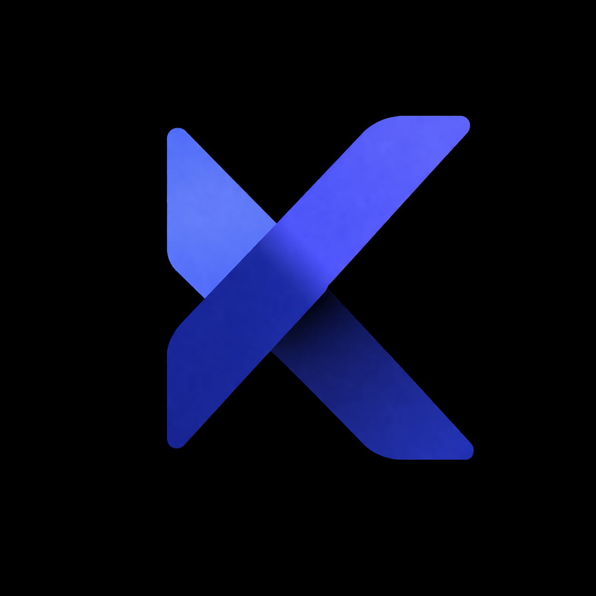

<div align="center">


</div>

<div align="center">
  
</div>

<div align="center">
  
</div>

<div align="center">
  <strong>Visita mi portafolio web:</strong><br>
  <a href="https://maufuenb.github.io/maufuenb/">https://maufuenb.github.io/maufuenb/</a>
</div>

---

## `> whoami`

```txt
Nombre   :: Mauricio Andrés Fuentes Bustamante
Alias    :: maufuenb
Base     :: Viña del Mar, Chile
Rol      :: Ingeniero Informático + Administrador de Empresas
Estado   :: Diseñando soluciones con mentalidad técnica y de negocio
Modo     :: Full stack pragmático, iterativo y apoyado en IA
```

## `> perfil`

Soy Mauricio, un profesional que combina tecnología, análisis y visión de negocios para construir proyectos con impacto real.

Me interesa crear soluciones modernas, útiles y bien pensadas, donde el código no solo funcione, sino que también responda a una necesidad concreta.

Mi enfoque es pragmático: conozco un poco de muchas tecnologías y aprovecho componentes, librerías, código reutilizable e inteligencia artificial para avanzar más rápido y mejor. No se trata de reinventar la rueda, sino de integrarla con criterio.

## `> stack.loading`

<div align="center">
  
  
  
  
  
  
  
  
  
  
  
  
  
  
  
  
  
  
</div>

## `> dev.philosophy`

```txt
No reinventar la rueda.
Construir con criterio.
Reutilizar componentes.
Integrar IA cuando aporta valor.
Moverse rápido sin perder enfoque.
```

## `> beyond.code`

Fuera del desarrollo, me mueven el anime, las películas, las series, los videojuegos y todo lo que combine creatividad con tecnología.

Me gusta desarmar, armar, reparar y optimizar hardware; ahí comenzó gran parte de mi interés por los computadores, la experimentación y la búsqueda de mejor rendimiento.

También disfruto el coleccionismo, las figuras, el maquetado y la impresión 3D, una mezcla que conversa muy bien con mi interés por construir experiencias y productos con identidad propia.

Mi estética está muy influenciada por la ciencia ficción, Blade Runner, Cyberpunk, el anime y autores como William Gibson, lo que empuja mi forma de crear hacia algo más futurista, moderno y disruptivo.

Y cuando necesito salir de la pantalla, conecto mucho con el trekking, el cerro, los bosques y las tardes tranquilas junto a un lago.

## `> github.stats`

<div align="center">
  
  
</div>

## `> featured.projects`

<br>

<div align="center">
  <a href="https://maufuenb.github.io/Alke-Wallet-Digital/">
    
  </a>
  <br><br>
  
  <br><br>
  
</div>

<br>

- `Alke Wallet Digital`: interfaz financiera moderna enfocada en experiencia visual, estructura clara y navegación fluida.

- `Kiveron`: ecosistema digital orientado a comunidades geek, diseñado para centralizar coleccionismo, interacción e intercambio dentro de una sola plataforma.

- `Beru`: sistema de asistencia inteligente para navegación, orientado a mejorar seguridad, autonomía operativa y apoyo en tiempo real a bordo.

## `> building.brands`

<div align="center">
  
</div>

<div align="center">
  <sub><strong>Kiveron</strong> y <strong>Kiveron Ads</strong> comparten el mismo núcleo visual como parte de un mismo ecosistema de productos.</sub>
</div>

## `> current.mission`

- Seguir aprendiendo, iterando y creando soluciones con estilo moderno.
- Aprovechar herramientas existentes para resolver mejor, no para complicar más.

## `> connect.exe`

<div align="center">
  <a href="https://github.com/maufuenb">
    
  </a>
  <a href="mailto:mauricio.fuentes.ab@gmail.com">
    
  </a>
</div>

---

<div align="center">
  <sub><strong>Initializing digital presence...</strong> system online.</sub>
</div>
